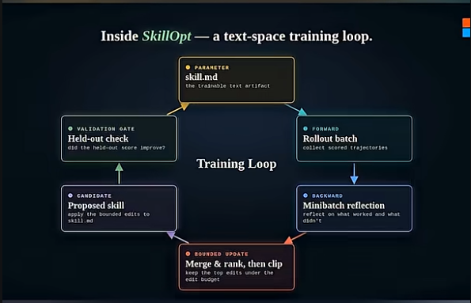

# Tipper training loop

**Home for agent improvement loops** — quality (evolve) and size (trim).

## Loops

| Loop | Purpose | Home |
|------|---------|------|
| **Evolve** (SkillOpt) | Train behavior — instincts, skills, rules | [TRAINING-LOOP.md](./TRAINING-LOOP.md) |
| **Trim** (Trim Hero → Cursor) | Shrink token spend — fixed + process + reads | [trim/INDEX.md](./trim/INDEX.md) |

---

## Evolve (quality)

| Read first | Purpose |
|------------|---------|
| [TRAINING-LOOP.md](./TRAINING-LOOP.md) | First principles — stage mapping |
| [ROLLOUT.yaml](./ROLLOUT.yaml) | Stage 2 — forward pass (scored trajectories) |
| [HELDOUT.yaml](./HELDOUT.yaml) | Stage 6 — validation gate |
| [LAST_EVOLVE.md](./LAST_EVOLVE.md) | Last backward + gate report |
| [forward.yaml](./forward.yaml) | Stage 2 instinct — when to log rollout |

**Invoke:** `Run tipper-evolve` · Skill: [`tipper-evolve`](../skills/tipper-evolve/SKILL.md)

---

## Trim (token economy)

**Core:** Don't waste time, energy, or agent tokens. Invoke: `Run tipper-trim` · Docs: [trim/TRIM-LOOP.md](./training-loop/trim/TRIM-LOOP.md)

Fixed per-turn target: always-on rules ≤ ~20 KB. Process tax: route minimal paths via sprint.

---

## Six stages → files (evolve)

| Stage | Name | Tipper artifact |
|-------|------|-----------------|
| 1 | **PARAMETER** | [`../instincts/`](../instincts/INDEX.md) · [`../skills/tipper-*/`](../skills/) · [`../rules/`](../rules/) |
| 2 | **FORWARD** | [`ROLLOUT.yaml`](./ROLLOUT.yaml) — written by ship / handoff |
| 3 | **BACKWARD** | [`../skills/tipper-evolve/SKILL.md`](../skills/tipper-evolve/SKILL.md) |
| 4 | **BOUNDED UPDATE** | evolve report — ≤ 3 file edits default |
| 5 | **CANDIDATE** | proposed diffs — no write until gate + approval |
| 6 | **VALIDATION GATE** | [`HELDOUT.yaml`](./HELDOUT.yaml) |

---

## Connected layers

| Layer | Path | Role |
|-------|------|------|
| **Instincts** | [`../instincts/`](../instincts/INDEX.md) | Fast weights; sprint loads ≤3 per step when domains tagged |
| **Sprint skills** | [`../skills/tipper-*/`](../skills/) | Procedure weights |
| **Rules** | [`../rules/`](../rules/) | Frozen law |
| **Ship / handoff** | ship · handoff skills | Evolve forward pass |
| **Trim** | [`trim/`](./trim/INDEX.md) | Payload audit |

---

## When to run evolve

| Trigger | Action |
|---------|--------|
| Every **ship** / **handoff --save** | Append 0–5 rows to `ROLLOUT.yaml` |
| `last_run` ≥ 14 days | Run **`tipper-evolve`** |
| ROLLOUT ≥ 3 **corrections** | Run **`tipper-evolve`** |
| User: **Run tipper-evolve** | Full loop stages 2→6 |

## When to run trim

| Trigger | Action |
|---------|--------|
| "What's eating context?" | **`tipper-trim`** audit |
| Always-on > budget (~20 KB) | **`tipper-trim`** |
| `LAST_TRIM.md` stale (>90d) | Re-audit |
