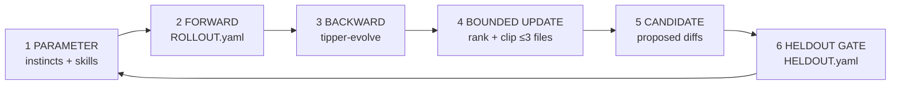

# Tipper text-space training loop

**First principles** — adapted from SkillOpt’s six-stage loop (see diagram below).


Tipper does not auto-train weights. We **train text artifacts** the same way: parameter → forward → backward → bounded update → candidate → validation gate → parameter.



**Home:** [`.cursor/training-loop/`](../training-loop/INDEX.md) — all loop artifacts live here.

---

## The six stages (Tipper mapping)

| Stage | SkillOpt | Tipper | Artifact |
|-------|----------|--------|----------|
| **1. PARAMETER** | `skill.md` | Trainable text | `skills/tipper-*/SKILL.md`, `instincts/*.yaml`, `rules/*.mdc` (promote only) |
| **2. FORWARD** | Rollout batch | Scored trajectories | `training-loop/ROLLOUT.yaml` — append on ship / handoff |
| **3. BACKWARD** | Minibatch reflection | What worked / failed | `tipper-evolve` reads batch since `last_run` |
| **4. BOUNDED UPDATE** | Merge & rank, clip | Rank edits, cap budget | Default **≤ 3 file edits** per evolve run |
| **5. CANDIDATE** | Proposed skill | Proposed diffs | Evolve report **before** write |
| **6. VALIDATION GATE** | Held-out check | Pressure scenarios | `training-loop/HELDOUT.yaml` — all must pass to land |

**Loop closure:** Only after stage 6 passes (or user accepts documented fail) may evolve write files and bump `LAST_EVOLVE.md` `last_run`.

**Constitution is frozen in forward pass:** `.cursor/rules/*.mdc` are not edited during normal sprints. Evolve may *propose* rule promotion; user approves explicitly.

---

## Layer roles (what is “the weight”)

```
rules/*.mdc          ── frozen law (always-on, rarely trained)
instincts/*.yaml     ── fast weights (sprint loads ≤3 per step via domain tags)
skills/tipper-*/     ── procedure weights (invoked roles)
```

| When instinct repeats and stabilizes | Promote to rule (law) or merge into skill (procedure) |
| When rule already owns the behavior | Instinct → `status: mirrored` (short reminder only) |
| When product truth changes | Refresh or prune instinct; update philosophy JSON if UI-facing |

---

## Stage 2 — Forward (rollout logging)

**Who writes:** `tipper-ship` (after checklist) and `tipper-handoff --save`.

**What:** 0–5 observations per session — not every chat turn.

```yaml
# training-loop/ROLLOUT.yaml entry shape
- id: obs-20260716-001
  at: 2026-07-16
  task: "money module wiring"
  artifact: affiliation-first-subscribe   # instinct id | skill name | rule
  outcome: pass | fail | correction     # fail = agent wrong; correction = user steered
  note: "PC9 cited correctly on subscribe path"
  source: ship | handoff | session
```

**Scoring (implicit):**

| outcome | Backward signal |
|---------|-----------------|
| `pass` | +confidence on artifact (+0.05, cap 0.95) |
| `correction` | log candidate; +0.1 confidence if same correction 3× |
| `fail` | −0.1 confidence; held-out must still pass after fix |

Keep **last 50** observations; evolve may archive older rows to `ROLLOUT.archive.yaml` if file grows.

---

## Stage 3 — Backward (minibatch reflection)

On `tipper-evolve`, read observations where `at > last_run`:

1. Group by `artifact` and `outcome`
2. List **patterns** (≥2 same artifact + correction/fail)
3. List **wins** (pass streaks — resist over-editing)
4. Cross-check git delta since `last_run` (product truth moved?)

Output: ranked **edit proposals** with reason tied to rollout ids.

---

## Stage 4 — Bounded update

| Knob | Default |
|------|---------|
| Max file edits per run | **3** |
| Max lines changed per file | **~40** (surgical) |
| Max new instincts per run | **2** |
| Promote to rule | **1** per run unless user expands budget |

Rank proposals: (1) repeated correction, (2) product epic mismatch, (3) stale wording, (4) nice-to-have.

**Clip:** Drop lowest-ranked items when over budget. Say so in report.

---

## Stage 5 — Candidate

Show exact diffs in evolve report. **Do not write** until:

- User says implement / approve / go ahead, **and**
- Stage 6 passes (or user accepts documented regression)

---

## Stage 6 — Validation gate (held-out)

Fixed scenarios in [`HELDOUT.yaml`](./HELDOUT.yaml). For each run:

| Result | Action |
|--------|--------|
| All **pass** | Land candidate → update `LAST_EVOLVE.md`, `instincts/INDEX.md`, trim rollout |
| Any **fail** | Do **not** land; fix proposal or strengthen artifact |
| **skip** | Only if scenario N/A this run — document why; max 2 skips per run |

Run in **fresh chat** or mental check with **candidate text** applied — not production files until gate passes.

---

## When the loop runs

| Trigger | Stages run |
|---------|------------|
| Every ship / handoff | **Forward only** (append rollout if notable) |
| Biweekly / evolve due / 3× correction | **Full loop** (2→6) |
| User: Run tipper-evolve | **Full loop** |

---

## Anti-patterns (do not train)

- Editing rules mid-sprint to “fix” one task
- Instinct prose that duplicates a rule verbatim (mirror instead)
- Evolve runs with zero rollout observations and zero git delta (skip unless user forces hygiene)
- Unbounded rewrites of `tipper-sprint` / `tipper-evolve` every session
- Shipping UI that contradicts held-out honest-MVP scenarios

---

## File index (this folder)

| File | Stage |
|------|-------|
| [`INDEX.md`](./INDEX.md) | Hub — connects instincts, skills, rules |
| [`TRAINING-LOOP.md`](./TRAINING-LOOP.md) | This doc — first principles |
| [`ROLLOUT.yaml`](./ROLLOUT.yaml) | Forward — scored trajectories |
| [`HELDOUT.yaml`](./HELDOUT.yaml) | Validation gate — fixed checks |
| [`LAST_EVOLVE.md`](./LAST_EVOLVE.md) | Last backward + gate report |
| [`forward.yaml`](./forward.yaml) | Stage 2 instinct |
| [`diagram.png`](./diagram.png) | SkillOpt reference diagram |

**Operator skill:** [`.cursor/skills/tipper-evolve/SKILL.md`](../skills/tipper-evolve/SKILL.md)

**Parameter inventory:** [`.cursor/instincts/INDEX.md`](../instincts/INDEX.md)
