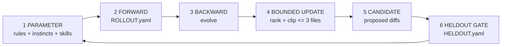

# The Hard Port — text-space training loop

**First principles** — adapted from SkillOpt's six-stage loop (see diagram below).


We don't train model weights. We train **text artifacts** — the rules, instincts, and skills
in `.cursor/` — the same way: parameter → forward → backward → bounded update → candidate →
validation gate → parameter.



**Home:** [`.cursor/skills/training-loop/`](./INDEX.md) — all loop artifacts live here.

---

## The six stages

| Stage | SkillOpt | Here | Artifact |
|-------|----------|------|----------|
| **1. PARAMETER** | `skill.md` | Trainable text | `.cursor/rules/*.mdc` (law), `.cursor/instincts/*/SKILL.md` (judgment), `.cursor/skills/*/SKILL.md` (procedure) |
| **2. FORWARD** | Rollout batch | Scored trajectories | `ROLLOUT.yaml` — append when a rule/instinct/skill gets tested by a real task |
| **3. BACKWARD** | Minibatch reflection | What worked / failed | `evolve` skill reads rows since `last_run` |
| **4. BOUNDED UPDATE** | Merge & rank, clip | Rank edits, cap budget | Default **<= 3 file edits** per evolve run |
| **5. CANDIDATE** | Proposed skill | Proposed diffs | Evolve report **before** write |
| **6. VALIDATION GATE** | Held-out check | Pressure scenarios | `HELDOUT.yaml` — all must pass to land |

**Loop closure:** Only after stage 6 passes (or the user accepts a documented fail) may evolve
write files and bump `LAST_EVOLVE.md`'s `last_run`.

**Rules are frozen in the forward pass:** `.cursor/rules/*.mdc` are not edited mid-task. Evolve
may *propose* promoting an instinct to a rule; the user approves explicitly.

---

## Layer roles (what is "the weight")

```
rules/*.mdc          -- frozen law (always-on, rarely trained)
instincts/*/SKILL.md -- judgment calls (invoked on relevant context, not glob-scoped)
skills/*/SKILL.md    -- procedures (invoked by name for a specific job)
```

| When | Do |
|------|-----|
| An instinct repeats and stabilizes across real tasks | Promote to a rule, or fold into a skill's procedure |
| A rule already fully owns the behavior an instinct describes | Shrink the instinct to a one-line pointer, or delete it |
| Brand truth changes (new offer, new tone call, new funnel step) | Refresh or prune the instinct/rule that's now stale |

---

## Stage 2 — Forward (rollout logging)

**Who writes:** the agent, at the end of a session or task where a rule/instinct/skill was
actually tested against a real decision — not every chat turn.

```yaml
# ROLLOUT.yaml entry shape
- id: obs-20260717-001
  at: 2026-07-17
  task: "packages-section tab labels"
  artifact: 01-copywriting-standards.mdc   # rule filename | instinct id | skill name
  outcome: pass | fail | correction        # fail = agent got it wrong; correction = user steered
  note: "Caught 'Compare Features'/'Detailed Breakdown' as banned SaaS labels, rewrote"
  source: session
```

**Scoring (implicit):**

| outcome | Backward signal |
|---------|-----------------|
| `pass` | Artifact is working as written — no action needed on repeat pass streaks |
| `correction` | Log candidate; consider strengthening the artifact if the same correction repeats 3x |
| `fail` | The artifact didn't prevent a real mistake — priority candidate for the next evolve run |

Keep **last 50** observations; evolve may archive older rows to `ROLLOUT.archive.yaml` if the
file grows large.

---

## Stage 3 — Backward (minibatch reflection)

On `evolve`, read observations where `at > last_run`:

1. Group by `artifact` and `outcome`.
2. List **patterns** (>= 2 same artifact + `correction`/`fail`).
3. List **wins** (pass streaks — resist over-editing something that's working).
4. Cross-check what actually shipped in the repo since `last_run` (did brand/funnel/offer truth move?).

Output: ranked **edit proposals**, each tied to specific rollout ids.

---

## Stage 4 — Bounded update

| Knob | Default |
|------|---------|
| Max file edits per run | **3** |
| Max lines changed per file | **~40** (surgical) |
| Max new instincts per run | **2** |
| Promote to rule | **1** per run unless the user expands the budget |

Rank proposals: (1) repeated correction/fail, (2) brand-truth mismatch, (3) stale wording, (4) nice-to-have.

**Clip:** drop the lowest-ranked items when over budget. Say so in the report.

---

## Stage 5 — Candidate

Show exact diffs in the evolve report. **Do not write** until:

- The user says implement / approve / go ahead, **and**
- Stage 6 passes (or the user accepts a documented regression).

---

## Stage 6 — Validation gate (held-out)

Fixed pressure-test prompts in [`HELDOUT.yaml`](./HELDOUT.yaml). For each evolve run:

| Result | Action |
|--------|--------|
| All **pass** | Land the candidate -> update `LAST_EVOLVE.md`, trim `ROLLOUT.yaml` if needed |
| Any **fail** | Do **not** land; fix the proposal or strengthen the artifact instead |
| **skip** | Only if a scenario is genuinely N/A this run — document why; max 2 skips per run |

Run each scenario as a fresh mental check with the **candidate text** applied — not by editing
production files first and hoping the gate passes after.

---

## When the loop runs

| Trigger | Stages run |
|---------|------------|
| End of a session where a rule/instinct/skill was tested | **Forward only** — append `ROLLOUT.yaml` if notable |
| Biweekly, or evolve is overdue, or 3x correction on the same artifact | **Full loop** (2-6) |
| User says: **Run evolve** | **Full loop** |

---

## Anti-patterns (do not train)

- Editing rules mid-task to "fix" one section instead of writing a proper candidate + gate
- Instinct prose that duplicates a rule verbatim (shrink to a pointer instead)
- Evolve runs with zero rollout observations and zero repo changes since `last_run` (skip unless the user forces a hygiene pass)
- Shipping copy or UI that contradicts a held-out brand scenario

---

## File index (this folder)

| File | Stage |
|------|-------|
| [`INDEX.md`](./INDEX.md) | Hub — connects rules, instincts, skills |
| [`TRAINING-LOOP.md`](./TRAINING-LOOP.md) | This doc — first principles |
| [`ROLLOUT.yaml`](./ROLLOUT.yaml) | Forward — scored trajectories |
| [`HELDOUT.yaml`](./HELDOUT.yaml) | Validation gate — fixed checks |
| [`LAST_EVOLVE.md`](./LAST_EVOLVE.md) | Last backward + gate report |
| [`forward.yaml`](./forward.yaml) | Stage 2 instinct |

**Operator skill:** [`.cursor/skills/evolve/SKILL.md`](../evolve/SKILL.md)

**Parameter inventory:** [`.cursor/instincts/INDEX.md`](../../instincts/INDEX.md)
