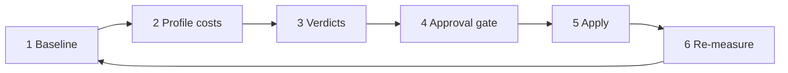

# The Hard Port — token economy loop

**Core decision:** Don't waste **time, energy, or agent tokens.** Every turn has a cost — fixed
payload, process choice, reads, tools, and session length. Trim exists to keep that cost
proportional to the work.

Adapted from [Trim Hero](https://github.com/kjmagnan1s/trim-hero) for **Cursor**. Trim Hero
measures API payload; we measure **what you pay every turn** and **what you pay per task** —
bytes are one proxy, not the whole story.

**Quality loop (evolve)** — train better behavior. **Economy loop (trim)** — spend fewer tokens
getting there. Same approval gate; different question.

---

## What costs tokens (four taxes)

| Tax | What burns tokens | Trim lever |
|-----|-------------------|------------|
| **Fixed per-turn** | `alwaysApply: true` rules — injected **every message** | `globs:`, relocate prose, slim entry |
| **Process per-task** | Full section-audit for a typo; wrong skill invoked for a small edit | Route to the minimal skill; skip gates that don't apply |
| **Read & tool** | Reading a whole rule file when a one-line pointer would do; unused MCP servers | On-demand skills; disable unused MCP |
| **Session** | Long threads; re-explaining context; re-reading files already read this session | Summarize instead of re-reading; keep instincts short |

**Rule:** Optimize the tax that dominates *this* waste — not only the biggest file.

`inventory.sh` measures **fixed per-turn** only. A full trim audit also asks: *did we
over-process, over-read, or over-tool for recent tasks?*

---

## Cursor levers

| Mechanism | Token effect |
|-----------|---------------|
| Always-on law | `.cursor/rules/*.mdc` with `alwaysApply: true` — **every turn** |
| Path-scoped law | `alwaysApply: false` + `globs:` — pay only when path matches |
| Skills | Invoked in chat — pay when used, not every turn |
| Instincts | Invoked on relevant context — bounded, not injected wholesale |
| MCP | Each server adds tool schema surface — disable unused in `~/.cursor/mcp.json` |

---

## Seven steps (trim skill)

| Step | Action | Measures |
|------|--------|----------|
| 1 Baseline | Run `scripts/inventory.sh` | Fixed per-turn bytes / est tokens |
| 2 Profile | Review recent session patterns (ROLLOUT, over-reading, wrong-skill routing) | Process + session tax |
| 3 Analyze | Rank all four taxes; update `INVENTORY.yaml` | Combined waste map |
| 4 Verdicts | **cut** / **keep** / **ask** — grounded in *token cost*, not file size alone | |
| 5 Gate | STOP — user approves exact edits | |
| 6 Apply | <= **3 file edits**; relocate law, don't erase it | |
| 7 Re-measure | Inventory + note expected turn savings | `LAST_TRIM.md` |

**Verdict threshold:** always-on segments that are large relative to `00-brand-core.mdc`, or
segments that caused repeated over-read/over-process noted in `ROLLOUT.yaml`.

---

## What NOT to cut

- `00-brand-core.mdc` — the one rule everything else in `.cursor/rules/` reports to.
- Anything the user has explicitly said is load-bearing.
- Brand/product truth — **relocate** to docs/instincts/skills, don't erase.

Cutting law to save bytes but causing rework burns **more** tokens. Trim is economy, not amnesia.

---

## Success = tokens saved, not bytes moved

| Good trim | Bad trim |
|-----------|----------|
| Long capability table -> doc link; agent reads on demand | Delete the table; agent guesses wrong |
| Typo fix -> inline edit, skip a full section-audit | Same full pipeline for every task regardless of size |
| `globs:` on a component-only rule | Duplicate rule + instinct saying the same thing |
| Disable unused MCP servers | Remove real harness guidance to save bytes |

**Estimate impact:** fixed-tax delta x expected turns in session + avoided over-processed turns.

---

## Operator

**Invoke:** `Run trim` · Skill: [`.cursor/skills/trim/SKILL.md`](../../trim/SKILL.md)

**Sibling:** [evolve loop](../TRAINING-LOOP.md) — quality; trim — economy.

---

## File index

| File | Purpose |
|------|---------|
| [INDEX.md](./INDEX.md) | Trim hub |
| [TRIM-LOOP.md](./TRIM-LOOP.md) | This doc — token economy first principles |
| [INVENTORY.yaml](./INVENTORY.yaml) | Segments + taxes + verdicts |
| [LAST_TRIM.md](./LAST_TRIM.md) | Last audit + estimated savings |
| [scripts/inventory.sh](./scripts/inventory.sh) | Fixed per-turn baseline (one proxy) |
