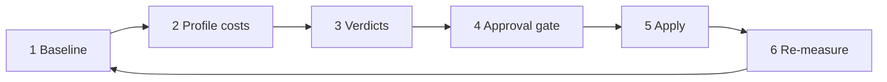

# Tipper token economy loop

**Core decision:** Don't waste **time, energy, or agent tokens**. Every turn has a cost — fixed payload, process choice, reads, tools, and session length. Trim exists to keep that cost proportional to the work.

Adapted from [Trim Hero](https://github.com/kjmagnan1s/trim-hero) for **Cursor** (not Claude Code). Trim Hero measures API payload; we measure **what you pay every turn** and **what you pay per task** — bytes are one proxy, not the whole story.

**Quality loop (evolve)** — train better behavior. **Economy loop (trim)** — spend fewer tokens getting there. Same approval gate; different question.

---

## What costs tokens (four taxes)

| Tax | What burns tokens | Trim lever |
|-----|-------------------|------------|
| **Fixed per-turn** | `alwaysApply: true` rules + `AGENTS.md` — injected **every message** | `globs:`, relocate prose, slim entry |
| **Process per-task** | Full sprint for a typo; explore when Grep suffices; evolve/trim when not due | `tipper-sprint` routing; skip gates |
| **Read & tool** | Reading 14 KB persona when link suffices; MCP servers unused; Figma without ask | On-demand skills; disable MCP; harness policy |
| **Session** | Long threads; no handoff; re-explaining context; duplicate mirrored law in thread | `handoff --save`; cap handoff load; mirrored instincts stay short |

**Rule:** Optimize the tax that dominates *this* waste — not only the biggest file.

`inventory.sh` measures **fixed per-turn** only. A full trim audit also asks: *did we over-process, over-read, or over-tool for recent tasks?*

---

## Cursor levers

| Mechanism | Token effect |
|-----------|--------------|
| Always-on law | `.cursor/rules/*.mdc` `alwaysApply: true` — **every turn** |
| Path-scoped law | `alwaysApply: false` + `globs:` — pay only when path matches |
| Entry pointer | Thin `AGENTS.md` — small fixed tax |
| Skills | Invoked in chat — pay when used, not every turn |
| Instincts | Handoff loads ≥ 0.7 — bounded session injection |
| MCP | Each server adds tool schema surface — disable unused in `~/.cursor/mcp.json` |
| Sprint routing | Wrong pipeline = many turns × fixed tax |

---

## Seven steps (tipper-trim skill)

| Step | Action | Measures |
|------|--------|----------|
| 1 Baseline | Run `scripts/inventory.sh` | Fixed per-turn bytes / est tokens |
| 2 Profile | Review recent session patterns (ROLLOUT, handoff, over-routing) | Process + session tax |
| 3 Analyze | Rank all four taxes; update `INVENTORY.yaml` | Combined waste map |
| 4 Verdicts | **cut** / **keep** / **ask** — grounded in *token cost*, not file size alone | |
| 5 Gate | STOP — user approves exact edits | |
| 6 Apply | ≤ **3 file edits**; relocate law, don't erase it | |
| 7 Re-measure | Inventory + note expected turn savings | `LAST_TRIM.md` |

**Verdict threshold:** always-on segments ≥ ~500 bytes **or** segments that caused repeated over-read / over-process in ROLLOUT.

---

## What NOT to cut

- `schema-migrations-hands-off`, core community gate, `question-means-plan-first`
- `tipper-agent-harness` Task/subagent guidance (prevents expensive mistakes)
- Active Stage 2 money surface law without explicit approval
- Product truth — **relocate** to docs/instincts/skills, don't erase

Cutting law to save bytes but causing rework burns **more** tokens. Trim is economy, not amnesia.

---

## Success = tokens saved, not bytes moved

| Good trim | Bad trim |
|-----------|----------|
| Persona tables → doc link; agent reads on product review only | Delete stocks table; agent guesses wrong |
| Typo → inline ship, skip product-review | Same pipeline for every task |
| `globs:` on web rule | Duplicate rule + instinct + long handoff recap |
| Disable unused MCP | Remove harness; agent role-plays subagents |

**Estimate impact:** fixed tax delta × expected turns in session + avoided process turns.

Example: −1,250 est tokens/turn × 20 turns = ~25k tokens saved per session — often more than one file trim.

---

## Portable template (future repos)

| Layer | Economy knob |
|-------|--------------|
| `AGENTS.md` | Thin pointer — minimal fixed tax |
| `rules/*.mdc` | Minimal `alwaysApply: true`; rest `globs:` |
| `instincts/` | Handoff loads high-confidence only; mirrored = short |
| `skills/` | Invoked, never always-on |
| `tipper-sprint` | Route minimal paths — process tax |
| `training-loop/trim/` | Copy this folder + `inventory.sh` |

**Operator:** [`.cursor/skills/tipper-trim/SKILL.md`](../../skills/tipper-trim/SKILL.md)

**Sibling:** [evolve loop](../TRAINING-LOOP.md) — quality; trim — economy.

---

## File index

| File | Purpose |
|------|---------|
| [INDEX.md](./INDEX.md) | Trim hub |
| [TRIM-LOOP.md](./TRIM-LOOP.md) | This doc — token economy first principles |
| [INVENTORY.yaml](./INVENTORY.yaml) | Segments + taxes + verdicts |
| [LAST_TRIM.md](./LAST_TRIM.md) | Last audit + estimated savings |
| [scripts/inventory.sh](./scripts/inventory.sh) | Fixed per-turn baseline (one proxy) |
