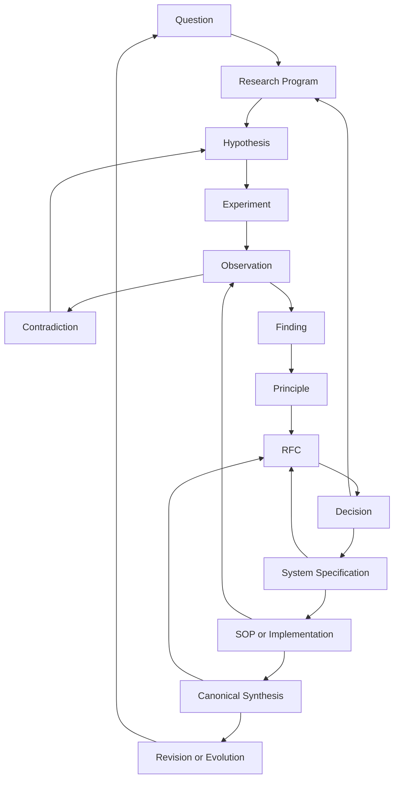

# Knowledge Architecture

## Purpose

Define how The Hard Port turns uncertainty into research, decisions, operational systems, repeatable execution, and canonical synthesis.

Philosophical assumptions inherited by this architecture — operational definitions of reality, conscious beings, systems, and their relationship — are defined in [`docs/00-foundations/THP-FOUNDATIONAL-PHILOSOPHY.md`](./docs/00-foundations/THP-FOUNDATIONAL-PHILOSOPHY.md). Institutional purpose and boundaries are defined in [`docs/00-foundations/THP-INSTITUTIONAL-PURPOSE-AND-BOUNDARIES.md`](./docs/00-foundations/THP-INSTITUTIONAL-PURPOSE-AND-BOUNDARIES.md). This file does not duplicate them.

This architecture governs document movement. It does not make the content of a source document true.

How knowledge **operates** through these stages — gates, advancement criteria, return paths, and procedure — is defined in [`docs/knowledge-system/research-methodology.md`](./docs/knowledge-system/research-methodology.md). This file defines lifecycle structure and placement; that document will define operational methodology.

This is the **knowledge lifecycle** — how claims and decisions move. It is not the people/customer journey in [`intelligence/layer-00-knowledge-engine.md`](./intelligence/layer-00-knowledge-engine.md). Those diagrams must remain separate ([`DEC-001`](./decisions/DEC-001-separate-knowledge-and-people-journeys.md)).

Things become canonical when they finish this designated loop ([`DEC-003`](./decisions/DEC-003-canon-requires-decision-record.md)). Canon is completion, not an editorial label.

## Lifecycle

## Stage 1 — Question

- **Purpose:** State a consequential uncertainty without presuming an answer.
- **Expected document:** `QUESTION-*`.
- **Folder:** `research/questions/`.
- **May enter:** Observed gaps, contradictions, stakeholder questions, failed outcomes, or Canon challenges.
- **Advances when:** The question is bounded, non-duplicate, connected to a decision or framework, and investigable.
- **Returns when:** Scope is still ambiguous, existing evidence already answers it, or another question contains it.

## Stage 2 — Research Program

- **Purpose:** Coordinate related questions, definitions, methods, evidence, and responsibilities.
- **Expected document:** `RESEARCH-PROGRAM-*`.
- **Folder:** `research/`.
- **May enter:** One or more qualified questions requiring coordinated investigation.
- **Advances when:** Scope, research boundary, owners, methods, and initial hypotheses are explicit.
- **Returns when:** The program is too broad, lacks access, or depends on undefined concepts.

## Stage 3 — Hypothesis

- **Purpose:** State a falsifiable explanation or prediction.
- **Expected document:** `HYP-*`.
- **Folder:** `research/hypotheses/`.
- **May enter:** Explanations derived from observations, questions, prior research, or models.
- **Advances when:** Context, mechanism, expected outcome, disconfirming evidence, alternatives, and next test are defined.
- **Returns when:** The claim is not falsifiable, duplicates another hypothesis, or depends on unresolved definitions.

## Stage 4 — Experiment

- **Purpose:** Create a bounded test capable of changing confidence in a hypothesis.
- **Expected document:** `EXP-*` or a linked intervention record.
- **Folder:** `research/experiments/`.
- **May enter:** A testable hypothesis with sufficient authority, access, safeguards, and measurement.
- **Advances when:** Baseline, method, outcomes, guardrails, delay, owner, and reversal conditions are defined.
- **Returns when:** The test cannot distinguish alternatives, required evidence is unavailable, or risk is disproportionate.

## Stage 5 — Observation

- **Purpose:** Record what occurred without embedding an unsupported explanation.
- **Expected document:** `OBS-*`.
- **Folder:** `research/observations/`, with business or interview evidence linked from their own folders.
- **May enter:** Direct observations, system records, artifacts, reported experiences, and measured outcomes.
- **Advances when:** Source, context, date, boundary, and relevant objects are recorded.
- **Returns when:** The record confuses observation with interpretation or lacks adequate provenance.

## Stage 6 — Contradiction

- **Purpose:** Preserve evidence that weakens, limits, or conflicts with a hypothesis, principle, system, or Canon claim.
- **Expected document:** `CONTRADICTION-*`.
- **Folder:** `research/contradictions/`.
- **May enter:** Counterexamples, failed replications, incompatible observations, or operational failures.
- **Advances when:** The affected claim and the nature of the conflict are explicit.
- **Returns when:** The conflict is caused by incompatible definitions, data errors, or unrelated context.

## Stage 7 — Finding

- **Purpose:** Summarize what the evidence currently supports within a defined boundary.
- **Expected document:** `FINDING-*`.
- **Folder:** `research/`, linked from the relevant program.
- **May enter:** A reviewed body of observations, experiments, and contradictions.
- **Advances when:** Sources, limitations, confidence, evidence level, and alternatives are documented.
- **Returns when:** Evidence is insufficient, contradictions remain unexplained, or the boundary is unstable.

## Stage 8 — Principle

- **Purpose:** Express a reusable proposition that has survived review within a stated context.
- **Expected document:** `PRINCIPLE-*`.
- **Folder:** `research/principles/`.
- **May enter:** Findings supported across relevant cases or operating conditions.
- **Advances when:** The principle improves explanation, diagnosis, design, or prediction and retains its counterexamples.
- **Returns when:** It merely restates a finding, claims universality, or lacks operational use.

## Stage 9 — RFC

- **Purpose:** Propose a meaningful change to repository architecture, policy, system design, or canonical model.
- **Expected document:** `RFC-###-short-title.md`.
- **Folder:** `rfcs/`.
- **May enter:** Supported principles, operational problems, system proposals, or Canon challenges.
- **Advances when:** Motivation, evidence, alternatives, counterarguments, affected systems, and open questions are reviewable.
- **Returns when:** More research is required, scope is unclear, or the proposal has no accountable decision owner.

## Stage 10 — Decision

- **Purpose:** Record an accepted institutional or cross-system decision and why it was made.
- **Expected document:** `DEC-###-short-title.md`.
- **Folder:** `decisions/`. Technical implementation decisions may use `adrs/`.
- **May enter:** A reviewed RFC or an urgent decision with documented context and retrospective RFC linkage.
- **Advances when:** Decision owners accept the choice, consequences, risks, and validation conditions.
- **Returns when:** The proposal is rejected, deferred, or sent back for research.

## Stage 11 — System Specification

- **Purpose:** Define current operational reality after a decision.
- **Expected document:** `SYS-*` using `systems/SYSTEM_TEMPLATE.md`.
- **Folder:** The relevant area under `systems/`.
- **May enter:** Accepted decisions and verified existing operating models.
- **Advances when:** Scope, state, rules, roles, interfaces, failure modes, governance, and validation are explicit.
- **Returns when:** The specification describes aspiration rather than current operation or conflicts with another system.

## Stage 12 — SOP or Implementation

- **Purpose:** Make the system repeatably executable or operational.
- **Expected document:** SOP, implementation artifact, or linked product specification.
- **Folder:** `sops/`, product code, or the relevant implementation repository.
- **May enter:** An accepted system specification with clear owners and interfaces.
- **Advances when:** Execution is repeatable, observed, and linked to the governing specification.
- **Returns when:** Operation exposes design failure, missing rules, or invalid assumptions.

## Stage 13 — Canonical Synthesis

- **Purpose:** Synthesize sufficiently stable and accepted knowledge across sources.
- **Expected document:** Canon chapter.
- **Folder:** The relevant volume under `canon/`.
- **May enter:** Accepted decisions, operational systems, supported research, and reviewed source documents.
- **Advances when:** Sources are cited, conflicts are resolved or visible, boundaries are explicit, and Canon review accepts the synthesis.
- **Returns when:** Evidence weakens, source conflicts remain material, operational reality diverges, or a challenge succeeds.

## Stage 14 — Revision or Evolution

- **Purpose:** Change, supersede, deprecate, fork, or remove knowledge that no longer fits reality.
- **Expected document:** RFC, decision, revised specification, revised chapter, supersession record, or archive entry.
- **Folder:** `rfcs/`, `decisions/`, `systems/`, `canon/`, or `archive/` according to outcome.
- **May enter:** Contradictions, drift, obsolescence, new evidence, implementation feedback, or deliberate forks.
- **Advances when:** The change follows the same evidence and decision path as the original material.
- **Returns when:** The proposed evolution lacks evidence, authority, compatibility analysis, or stewardship.

## Layer Responsibilities

- `research/` investigates reality.
- `rfcs/` proposes meaningful changes or system designs.
- `decisions/` records accepted institutional decisions and rationale.
- `adrs/` records accepted technical architecture decisions.
- `systems/` defines current operational models.
- `sops/` defines repeatable execution.
- `canon/` synthesizes accepted knowledge into the eight-volume body.
- `archive/` preserves obsolete, superseded, or session-specific material.

## Non-Linear Movement

The lifecycle is not a promotion conveyor. Any stage may expose missing evidence or invalid assumptions. Material returns to the earliest stage capable of resolving the problem.

No document advances merely because it is old, polished, frequently cited, or located in a higher-authority folder.

## Revision History

### 0.1.0 — 2026-07-18

- Defined the repository knowledge lifecycle, stage gates, return paths, and folder responsibilities.
