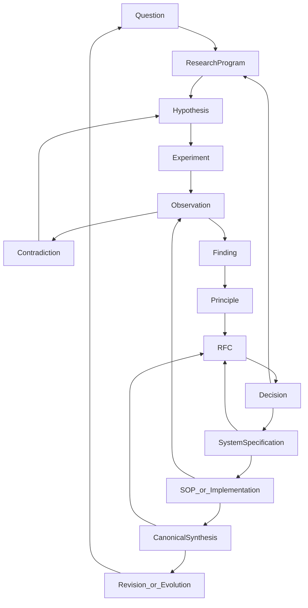

# Knowledge Architecture

## Purpose

Define how The Hard Port turns uncertainty into research, decisions, operational systems, repeatable execution, and canonical synthesis — and how those forms of knowledge remain distinguishable.

This chapter exists so later Canon volumes, RFCs, decisions, and system specifications can cite one lifecycle instead of inventing parallel ones.

It governs document movement and authority boundaries. It does not make the content of a source document true.

## Scope

### Includes

- The working knowledge-production layer and the Canon synthesis layer
- Document types and their folders
- Lifecycle stages, entry conditions, advancement gates, and return paths
- Distinctions among truth claims, operational decisions, system definitions, and canonical synthesis
- Meanings of `status`, `confidence`, `evidence_level`, and `canonicality`
- Challenge, revision, supersession, deprecation, and archive
- Tipper's role as implementation and evidence-return instrument
- The role of human judgment in acceptance and canonicity

### Excludes

- Domain ontology of small businesses (Volume V)
- Research method detail beyond lifecycle placement (Volume IV)
- Tipper product design (Volume VI)
- Consulting packages, website copy, or client-facing offers
- Promotion of unfinished philosophy or research into doctrine

## Core Claim

The Hard Port's knowledge system is a gated lifecycle, not a folder hierarchy of finished truth.

Working documents investigate, propose, decide, specify, and execute. Canon chapters synthesize only what has been sufficiently reviewed, bounded, and source-backed. Tipper may operationalize supported patterns and return evidence; it does not replace research, decision, or Canon authority.

No document becomes authoritative because it is polished, old, frequently cited, or located under `intelligence/` or `canon/`.

## Definitions

### Research

Coordinated investigation of reality through questions, programs, hypotheses, experiments, observations, contradictions, findings, and principles. Lives primarily under [`../../research/`](../../research/).

### Hypothesis

A falsifiable explanation or prediction with context, mechanism, expected outcome, and disconfirming evidence. Record type `HYP-*` in [`../../research/hypotheses/`](../../research/hypotheses/).

### Experiment

A bounded test capable of changing confidence in a hypothesis, with baseline, method, outcomes, guardrails, and review conditions. Lives under [`../../research/experiments/`](../../research/experiments/) or as a linked intervention record.

### Observation

A record of what occurred without unsupported explanation embedded as fact. Record type `OBS-*` under [`../../research/observations/`](../../research/observations/), with field evidence also linked from businesses or interviews.

### Contradiction

Evidence that weakens, limits, or conflicts with a claim, hypothesis, principle, system, or Canon chapter. Lives under [`../../research/contradictions/`](../../research/contradictions/).

### Finding

A bounded summary of what current evidence supports, including limitations, alternatives, confidence, and evidence level.

### Principle

A reusable proposition that has survived review within a stated context and remains open to counterexamples. Record type `PRINCIPLE-*` under [`../../research/principles/`](../../research/principles/). Working principles that have not survived review remain non-canonical candidates.

### RFC

A proposal for a meaningful change to architecture, policy, system design, or Canon material. Lives under [`../../rfcs/`](../../rfcs/). An RFC does not itself accept the change.

### Decision

An accepted institutional or cross-system choice with rationale, alternatives, consequences, risks, and validation conditions. Lives under [`../../decisions/`](../../decisions/). Technical architecture decisions may use [`../../adrs/`](../../adrs/).

### System specification

A versioned description of current operational reality: entities, states, rules, roles, interfaces, permissions, failure modes, and validation. Lives under [`../../systems/`](../../systems/).

### SOP

A repeatable procedure that executes an accepted system specification. Lives under [`../../sops/`](../../sops/).

### Implementation

Software, product, or operating practice that realizes a system specification in the world. Tipper is one implementation. Implementation is not identical to The Hard Port.

### Canon chapter

Reviewed synthesis of sufficiently stable, accepted, source-backed knowledge within a volume. Lives under [`../`](../). Seed and candidate chapters are not doctrine.

### Archived material

Obsolete, superseded, session-specific, or raw provenance retained for history. Lives under [`../../archive/`](../../archive/). Archive is not current authority.

### Truth claim

A claim about what is the case in a defined context. It requires evidence, confidence, and revision conditions. It is not accepted merely by being written.

### Operational decision

A choice about what The Hard Port or a governed system will do. It requires owners, consequences, and validation. It is not identical to a truth claim.

### System definition

A specification of how something currently operates. It can be wrong about reality and still be the current governing model until revised.

### Canonical synthesis

A reviewed account of what The Hard Port currently treats as authoritative within stated boundaries, citing working sources without erasing their independent status.

## Model

### Two layers

```text
Working knowledge-production layer
  research → RFC → decision → system → SOP / implementation
        ↓
Canonical publication layer
  synthesis, challenge, revision
        ↓
Evidence returns to the working layer
```

Defined in [`../../KNOWLEDGE_ARCHITECTURE.md`](../../KNOWLEDGE_ARCHITECTURE.md) (`defines`; status `active`) and [`../README.md`](../README.md) (`defines`; status `active`).

Things become canonical when they finish their designated loop: Research → RFC → Decision → System → Canon. Decision Records record that completion; they do not replace unfinished stages. Assistants may draft; they do not grant canonicity ([`DEC-003`](../../decisions/DEC-003-canon-requires-decision-record.md)).

### Knowledge lifecycle versus people journey

Per [`DEC-001`](../../decisions/DEC-001-separate-knowledge-and-people-journeys.md), these are different diagrams:

| Diagram | Object | Example |
|---|---|---|
| Knowledge lifecycle | Claims, evidence, decisions, systems, Canon | Question → Hypothesis → Experiment → Observation → Finding → RFC → Decision → System → Canon |
| People / customer journey | Attention, owners, clients, Tipper participation | Media → conversations → consulting → frameworks → Tipper → evidence return ([`CIS-L00`](../../intelligence/layer-00-knowledge-engine.md)) |

They must not compete or be nested as if one replaced the other. Evidence from the people journey enters this lifecycle at Observation, Experiment, Contradiction, or Finding.

### Full lifecycle



### Entry and exit by stage

| Stage | Enters when | Advances when | Returns when |
|---|---|---|---|
| Question | A consequential uncertainty appears | Bounded, non-duplicate, investigable, decision-linked | Ambiguous, already answered, or duplicate |
| Research program | Related questions need coordination | Scope, methods, owners, and initial hypotheses are explicit | Too broad, no access, undefined concepts |
| Hypothesis | A falsifiable explanation is proposed | Context, mechanism, outcomes, and disconfirmers are stated | Not falsifiable or dependent on undefined terms |
| Experiment | A test can change confidence safely | Baseline, method, guardrails, delay, owner exist | Cannot discriminate alternatives or risk is disproportionate |
| Observation | Something occurred and can be recorded | Source, context, date, and boundary are present | Observation and interpretation are collapsed |
| Contradiction | Evidence conflicts with a claim | Affected claim and conflict nature are explicit | Conflict is definitional noise or data error |
| Finding | A body of evidence has been reviewed | Limitations, alternatives, confidence, and evidence level are stated | Evidence insufficient or boundary unstable |
| Principle | Findings survive reuse in context | Improves explanation or action and retains counterexamples | Restates a finding or claims universality |
| RFC | Change needs review | Motivation, evidence, alternatives, and owners are reviewable | More research required or no decision owner |
| Decision | RFC reviewed or urgent choice documented | Owners accept choice, consequences, risks, validation | Rejected, deferred, or returned to research |
| System specification | Decision accepted or current operation verified | Scope, state, rules, roles, interfaces, failures explicit | Spec is aspiration, not current reality |
| SOP / implementation | Spec can be executed | Execution is repeatable, observed, and linked | Operation exposes invalid design |
| Canonical synthesis | Sources, decisions, and systems are reviewable | Conflicts visible or resolved; review accepts synthesis | Evidence weakens or challenge succeeds |
| Revision / evolution | Drift, contradiction, fork, or obsolescence appears | Change follows the same evidence and decision path | Lacks evidence, authority, or stewardship |

### Metadata dimensions

From [`../../templates/DOCUMENT_METADATA_STANDARD.md`](../../templates/DOCUMENT_METADATA_STANDARD.md) (`defines`; status `active`):

| Dimension | Meaning |
|---|---|
| `status` | Lifecycle maturity: seed, draft, active, under-review, accepted, canonical, superseded, deprecated, archived |
| `confidence` | Epistemic confidence: unknown, low, medium, high |
| `evidence_level` | Available support: none, anecdotal, observational, experimental, replicated, operational ([`DEC-002`](../../decisions/DEC-002-descriptive-evidence-vocabulary.md)) |
| `canonicality` | Canon authority: non-canonical, candidate, canonical |

These dimensions are independent. An active system can remain non-canonical. A high-confidence finding can remain a candidate. A canonical chapter may still contain unresolved questions.

Legacy `E0`–`E5` codes are deprecated for new work. Migration mapping lives in DEC-002 and [`../../intelligence/README.md`](../../intelligence/README.md).

### Challenge and change

Any Canon or working claim may be challenged by new evidence, contradiction, operational drift, or disputed decision.

Challenge begins in the working layer. Material returns to the earliest stage capable of resolving the problem. Accepted changes produce decision records, system updates where relevant, and versioned Canon revision.

Superseded documents retain reciprocal links. Deprecated documents remain addressable but must not guide new work. Archived documents preserve provenance and are not current authority.

### Tipper in the architecture

Tipper is the first operational implementation through which The Hard Port may put supported patterns in front of businesses, support bounded action, observe behavior, measure outcomes, and return evidence.

Tipper is not The Hard Port. It does not own mission, philosophy, Canon authority, or institutional decision rights. Human judgment remains required for diagnosis, acceptance, and canonicity.

Sources: [`../../intelligence/layer-08-tipper-intelligence-framework.md`](../../intelligence/layer-08-tipper-intelligence-framework.md) (`defines` / `limits`; status `draft`); [`../README.md`](../README.md) (`limits`).

### Human judgment

Software and documents can store evidence, surface patterns, and constrain process. They cannot replace owners of decisions or Canon review.

Human judgment is required to:

- Accept or reject RFCs and decisions
- Judge whether a system specification matches operational reality
- Decide whether synthesis is ready for `canonicality: canonical`
- Preserve contradictions instead of deleting inconvenience
- Stop Tipper or any implementation from overstating confidence

## Principles

These principles are synthesized from existing architecture sources. They remain chapter-level working principles until this chapter itself is accepted as canonical.

1. **Lifecycle over location.** Authority comes from stage gates and review, not from folder placement.
2. **Independence of metadata.** Status, confidence, evidence level, and canonicality must not be collapsed.
3. **Return paths are mandatory.** Failed tests, contradictions, and drift send material backward.
4. **Canon cites; it does not erase.** Working sources keep their own status after synthesis.
5. **Tipper returns evidence.** An implementation that cannot return outcomes is incomplete as a research instrument.
6. **Judgment remains human.** Acceptance and canonicity require accountable people.
7. **Canon is loop completion.** Material becomes canonical when it finishes its designated loop, not when prose is polished or a file is placed under `canon/`.

## Boundaries

- This chapter does not validate domain claims about businesses, owners, or Tipper features.
- Seed Canon chapters are not doctrine.
- Intelligence frameworks are working sources, not automatic Canon.
- Archive raw files are provenance only.
- No fictional Decision Records are implied by this synthesis.
- Institutional decisions and technical ADRs remain distinct.

## Implications

If this architecture holds:

- Later Canon volumes must cite lifecycle stages rather than invent promotion rules.
- RFCs and decisions become the normal path for structural change.
- Tipper work must preserve evidence-return and human override.
- Philosophy and research may remain non-canonical for long periods without failure.
- Instruction layers (`cursor.md`, `CURRENT_FOCUS.md`, `CURRENT_TASK.md`) assign work; they do not grant canonicity.

## Unresolved Questions

- Where should `FINDING-*` records live when no dedicated folder yet exists?
- What named human owners accept Canon canonicity in practice (beyond the institutional owner label)?
- How should consulting methodology stages in Layer 07 map onto experiment and observation without duplicating the people journey?
- Which early documents marked `canonicality: canonical` without Decision Records require retrospective DEC reaffirmation under DEC-003?

## Proposed Validation Criteria

This chapter is ready for canonicity review only when:

1. Conflicts with `KNOWLEDGE_ARCHITECTURE.md` are resolved or decided — Category A conflicts decided in DEC-001, DEC-002, DEC-003.
2. Accepted Decision Records affirm separation of journeys, evidence vocabulary, and Canon-via-Decision (this criterion is met for Category A).
3. Folder responsibilities in the repository match the stage table.
4. A challenge test has been run: one seed claim is deliberately contested and returned through the lifecycle without silent deletion.
5. Citation examples in this chapter resolve and use source roles correctly.
6. Named human owners for Canon acceptance are recorded in a Decision or governance note.
7. Canonicity change cites DEC-003 and does not rely on assistant authorship.

## Related Documents

- [`../../KNOWLEDGE_ARCHITECTURE.md`](../../KNOWLEDGE_ARCHITECTURE.md)
- [`../../templates/DOCUMENT_METADATA_STANDARD.md`](../../templates/DOCUMENT_METADATA_STANDARD.md)
- [`../README.md`](../README.md)
- [`../CANON_CITATION_STANDARD.md`](../CANON_CITATION_STANDARD.md)
- [`../CANON_STATUS.md`](../CANON_STATUS.md)
- [`../../decisions/DEC-001-separate-knowledge-and-people-journeys.md`](../../decisions/DEC-001-separate-knowledge-and-people-journeys.md)
- [`../../decisions/DEC-002-descriptive-evidence-vocabulary.md`](../../decisions/DEC-002-descriptive-evidence-vocabulary.md)
- [`../../decisions/DEC-003-canon-requires-decision-record.md`](../../decisions/DEC-003-canon-requires-decision-record.md)
- [`../../intelligence/layer-00-knowledge-engine.md`](../../intelligence/layer-00-knowledge-engine.md)
- [`../../intelligence/layer-08-tipper-intelligence-framework.md`](../../intelligence/layer-08-tipper-intelligence-framework.md)
- [`../../intelligence/README.md`](../../intelligence/README.md)
- [`../../cursor.md`](../../cursor.md)
- [`../../systems/intelligence/`](../../systems/intelligence/)
- [`../../systems/evolution/`](../../systems/evolution/)

## Source Documents

```yaml
- path: ../../KNOWLEDGE_ARCHITECTURE.md
  id: ARCH-KNOWLEDGE-001
  version: 0.1.0
  section: Lifecycle
  status: active
  canonicality: canonical
  role: defines
- path: ../../templates/DOCUMENT_METADATA_STANDARD.md
  id: STD-DOC-001
  version: 0.1.0
  section: Four Independent Dimensions
  status: active
  canonicality: canonical
  role: defines
- path: ../README.md
  id: CANON-INDEX
  version: 0.1.0
  section: Conditions for Entry
  status: active
  canonicality: canonical
  role: defines
- path: ../CANON_CITATION_STANDARD.md
  id: CANON-CITATION-001
  version: 0.1.0
  section: Rules
  status: active
  canonicality: canonical
  role: defines
- path: ../../intelligence/layer-00-knowledge-engine.md
  id: CIS-L00
  version: 0.1.0
  section: Institutional Model
  status: draft
  canonicality: non-canonical
  role: context
- path: ../../intelligence/layer-08-tipper-intelligence-framework.md
  id: CIS-L08
  version: 0.2.0
  section: Role in the Knowledge Engine
  status: draft
  canonicality: non-canonical
  role: limits
- path: ../../cursor.md
  id: null
  version: null
  section: Permanent Non-Negotiables
  status: active
  canonicality: non-canonical
  role: limits
```

## Revision History

### 0.3.1 — 2026-07-18

- Clarified DEC-003: canonicity is completion of the designated loop, not a Decision stamp alone.

### 0.3.0 — 2026-07-18

- Applied DEC-001: knowledge lifecycle and people journey are separate diagrams.
- Applied DEC-002: descriptive evidence vocabulary; E0–E5 deprecated for new work.
- Applied DEC-003: Canon requires Research → RFC → Decision → System → Canon.
- Kept `canonicality: candidate`; no silent promotion.

### 0.2.0 — 2026-07-18

- Developed the chapter from repository architecture sources.
- Defined document types, lifecycle gates, metadata dimensions, Tipper boundary, and human judgment requirements.
- Kept `canonicality: candidate`; no silent promotion to canonical.

### 0.1.0 — 2026-07-18

- Created seed chapter structure. No substantive claim had been accepted.
